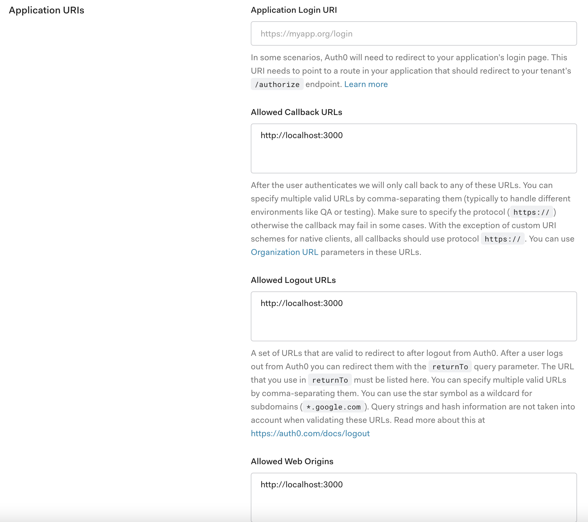

# Demo I+D
## Tecnology Stack

- [Service Stack](https://servicestack.net/): One framework to power them all. Write your HTTP APIs once and take advantage of end to end typed integrations for all popular Web, Mobile and Desktop platforms.
- [React](https://reactjs.org/): A JavaScript library for building user interfaces
- [Auth0](https://auth0.com/): Auth0 is an easy to implement, adaptable authentication and authorization platform. Secure access for everyone. But not just anyone.
- [Docker](https://www.docker.com/): Docker takes away repetitive, mundane configuration tasks and is used throughout the development lifecycle for fast, easy and portable application development - desktop and cloud. Docker’s comprehensive end to end platform includes UIs, CLIs, APIs and security that are engineered to work together across the entire application delivery lifecycle.
- [Docker Compose](https://docs.docker.com/compose/gettingstarted/): Docker Compose relies on Docker Engine for any meaningful work, so make sure you have Docker Engine installed either locally or remote, depending on your setup.
- [NodeJs](https://nodejs.org/en/): Node.js® is a JavaScript runtime built on [Chrome's V8 JavaScript engine](https://v8.dev/). 

## Requirements

- Node version 10
- Docker version 20.10.5, build 55c4c88
- docker-compose version 1.29.0, build 07737305

## Installation

- ### **1-** Clone de project  from Github

```bash
$> git clone https://github.com/alexeidzoto/demo-tech.git
$> cd demo-tech
```

- ### 2- Deploy ServiceStack with Chinook database

```shell
$> npm run start:chinook
```

- ### 3- Create user in [Auth0](https://auth0.com/signup?place=header&type=button&text=sign%20up) and copy Domain and Client ID


### Configure Callback URLs

A callback URL is a URL in your application where Auth0 redirects the user after they have authenticated. The callback URL for your app must be added to the **Allowed Callback URLs** field in your [Application Settings](https://manage.auth0.com/#/applications). If this field is not set, users will be unable to log in to the application and will get an error.

### Configure Allowed Web Origins

You need to add the URL for your app to the **Allowed Web Origins** field in your [Application Settings](https://manage.auth0.com/#/applications/YOUR_CLIENT_ID/settings). If you don't register your application URL here, the application will be unable to silently refresh the authentication tokens and your users will be logged out the next time they visit the application, or refresh the page.

### Configure Logout URLs

A logout URL is a URL in your application that Auth0 can return to after the user has been logged out of the authorization server. This is specified in the `returnTo` query parameter. The logout URL for your app must be added to the **Allowed Logout URLs** field in your [Application Settings](https://manage.auth0.com/#/applications). If this field is not set, users will be unable to log out from the application and will get an error.




- ### 4- Rename `apps/react-materialui/.env.example` to `apps/react-materialui/.env` and add the information from STEP 3

```bash
REACT_APP_AUTH0_DOMAIN="Domain from STEP 3"
REACT_APP_AUTH0_CLIENT_ID="Client ID from STEP 3"
REACT_APP_SERVICESTACK_API="http://localhost:8090"
```

- ### 5- Deploy Demo I+D

```bash
$> npm run start-demoid
```

## Usage

> **Services Stack with Chinook**

-  http://localhost:8090/metadata


> **Demo I+D**

- http://localhost:3000

